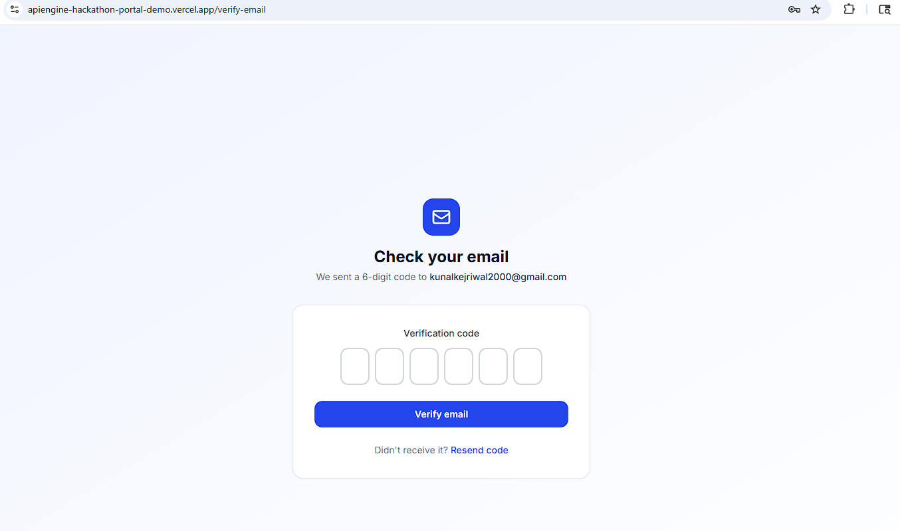
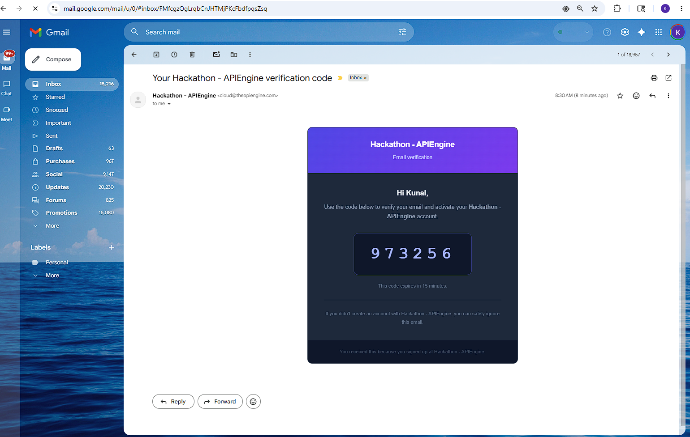
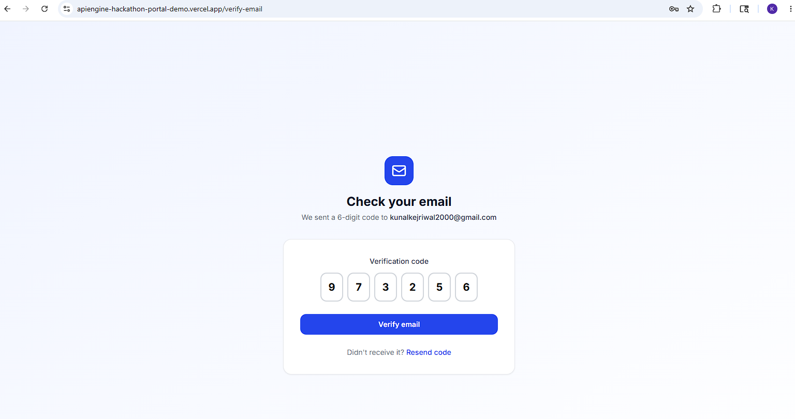
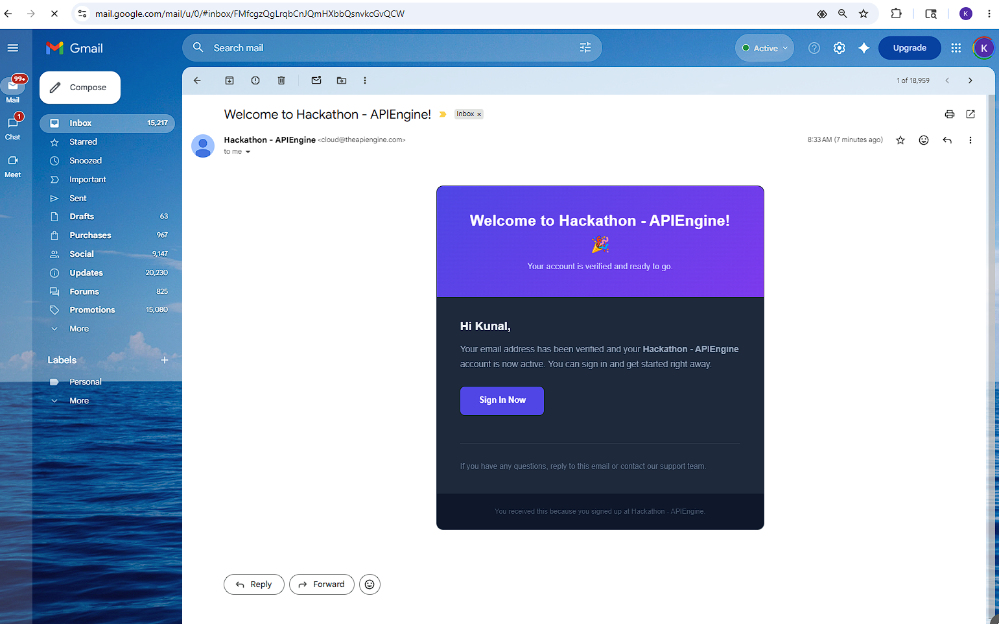
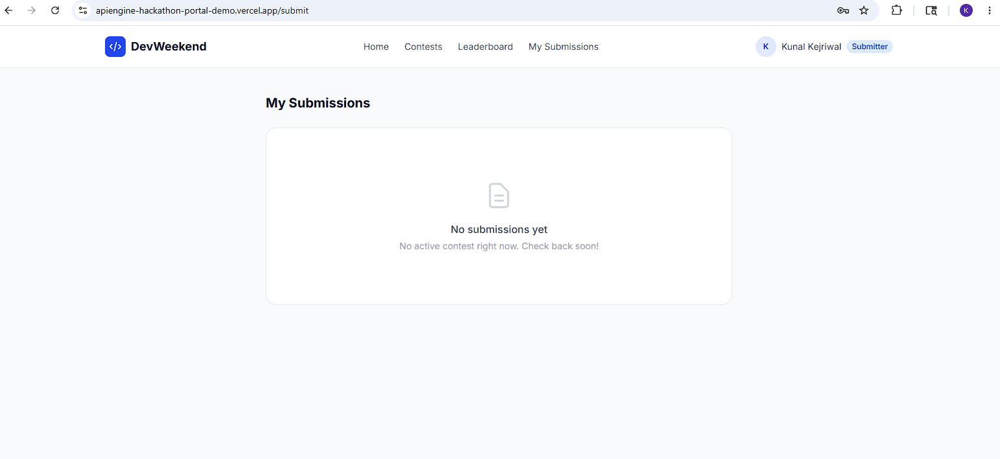

# About DevWeekend Hackathon Portal

**Live demo:** [https://apiengine-hackathon-portal-demo.vercel.app](https://apiengine-hackathon-portal-demo.vercel.app)

DevWeekend is a full-stack hackathon platform built entirely on **APIEngine** as the backend — no custom server required. Organizers post contests, participants submit projects, and reviewers score them. Role-based access is enforced end to end.

---

## Three roles, one platform

| Role | What they can do |
|---|---|
| **Admin / Organizer** | Create and manage contests, review all submissions, assign reviewer roles to users |
| **Reviewer** | Browse the pending submission queue, submit ratings (1–10) and written feedback |
| **Submitter** | Sign up, verify email, and submit a project during an active contest |

---

## Signup Flow

New users go through a 3-step flow powered by APIEngine's SDK Auth and built-in email templates — no custom email infrastructure needed.

### Step 1 — Verify your email

After signing up, the app redirects to the verify-email screen. APIEngine sends a 6-digit code to the user's inbox.

---

### Step 2 — Code arrives via APIEngine email template

The verification email is delivered automatically using APIEngine's template system, branded with the app name.

---

### Step 3 — Enter the code

The user types (or pastes) the 6-digit code into the individual input boxes.

---

### Step 4 — Welcome email sent automatically

On successful verification, APIEngine fires a welcome email — again using its built-in template, zero configuration required.

---

### Step 5 — Authenticated and into the app

The user is signed in as a **Submitter** and lands on their My Submissions dashboard, ready to enter a contest.

---

## How it's built

The app uses two separate Axios clients reflecting APIEngine's two auth layers:

- **`devClient`** — carries the developer JWT + developer API key. Used for admin operations: creating contests, updating submission status, managing roles.
- **`sdkClient`** — carries the AppUser JWT + SDK tenant key. Used for end-user operations: submitting projects, posting reviews, reading the leaderboard.

Role data is stored in APIEngine's **JSON DB** (`user-roles` collection) since AppUser accounts have no `custom_data` field. The role is fetched at login and drives all route protection.

---

## Tech stack

| Layer | Choice |
|---|---|
| Framework | React 18 + Vite 5 |
| Styling | Tailwind CSS 3 |
| Routing | React Router DOM v6 |
| HTTP | Axios (two client instances) |
| Notifications | react-hot-toast |
| Backend | [APIEngine](https://theapiengine.com) |

---

*Built with [Claude Code](https://claude.ai/code) · Backend by [APIEngine](https://theapiengine.com)*
